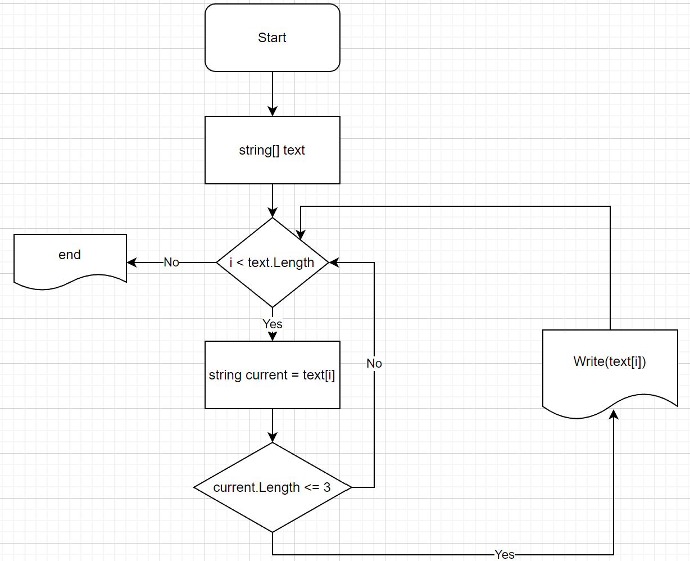

# first_quarter_HW

## Написать программу, которая из имеющегося массива строк формирует массив из строк, длинна которых меньше либо равна 3 символа. Первоначальный массив можно ввести  клавиатуры, либо задать на старте выполнения алгоритма.

Берем каждый элемент заданного массива и присваеваем его в новую переменную string в цикле. Замеряем длинну перемнной, если меньше или равен 3м, то выводим элемент массива, если больше, то переходим к новому следующему элементу массива.

# Блок-схема:

